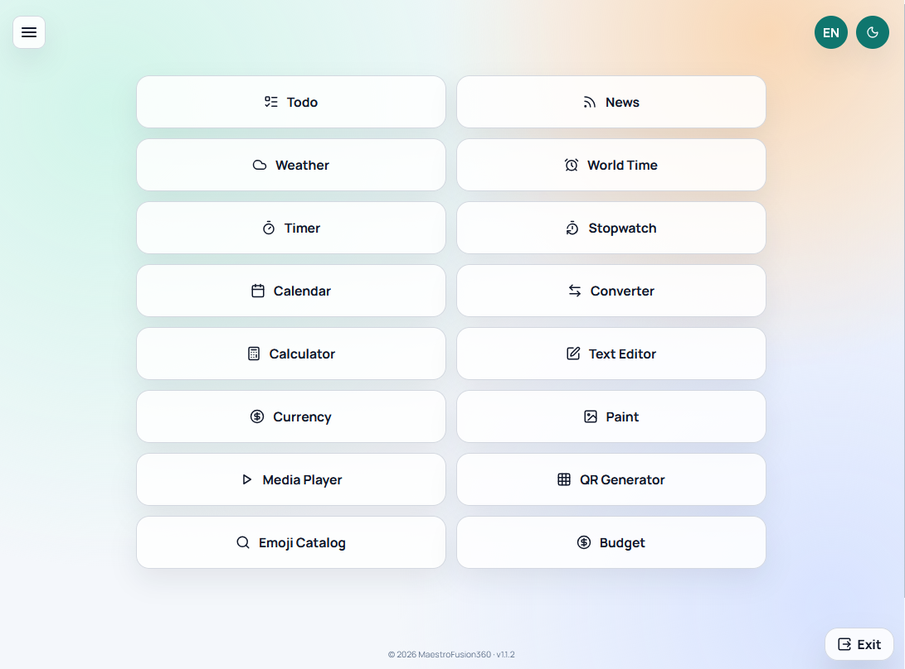
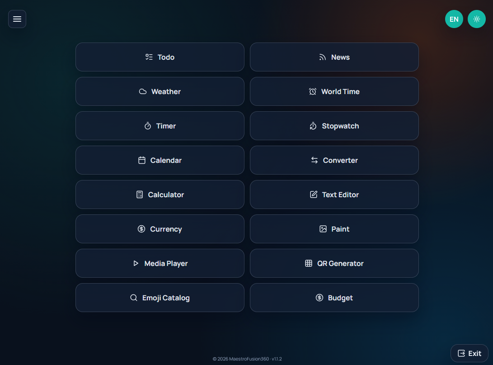

<!-- markdownlint-disable MD033 -->
<!-- markdownlint-disable MD039 -->

#  Mobile Tools

**Mobile Tools** was created as a lightweight offline-first app so you can keep useful daily tools in one place, fast and distraction-free, even with unstable internet.

Current app version: **1.0.5**

---

<p align="center">
  
  
</p>

---

- [ Mobile Tools](#-mobile-tools)
  - [Features](#features)
  - [Architecture](#architecture)
    - [Startup Flow](#startup-flow)
  - [Architecture Overview](#architecture-overview)
  - [Project Structure](#project-structure)
  - [Quick Start](#quick-start)
  - [Testing](#testing)
  - [External APIs](#external-apis)
  - [Assets \& Credits](#assets--credits)
  - [License](#license)

## Features

- **Progressive Web App (PWA)** - offline-first shell, Service Worker caching, and Web App Manifest support for installable mobile and desktop use.

- **Responsive multi-tool interface** - adapted for both mobile and desktop, with card-based pages and compact controls.

- **Todo + Notes**
  - Task management with add, complete, delete, and clear completed actions.
  - Task filters for **All / Active / Done**.
  - Drag-and-drop sorting for task items and note cards.
  - Rich-text notes editor with formatting actions such as **bold, italic, underline, strikethrough, ordered list, and links**.
  - Quick create and save flow with note card previews.
  - Unified action buttons with cleaner compact controls.

- **RSS News**
  - RSS feed management with add, remove, refresh, and JSON import/export.
  - Articles grouped by time periods such as **today, yesterday, this week, and older**.
  - Read-later mode for saving items to review later.
  - Swipe-to-read interactions with gesture feedback and threshold-based commit for mobile-friendly usage.

- **Weather**
  - Support for both **geolocation mode** and **manual coordinates input**.
  - Reverse geocoding for detected locations.
  - Current weather metrics, forecast blocks, and sunrise/sunset information.
  - Favorites, saved home point, and city presets for quick access.

- **World Time**
  - Multiple timezone selection.
  - Switchable **24-hour / 12-hour** time display.

- **Timer**
  - Start, pause, resume, and reset controls.
  - Live status updates during countdown.

- **Stopwatch**
  - Start, pause, resume, and reset actions.
  - Lap tracking support.

- **Calendar + Date Difference**
  - Month navigation and date picking.
  - Range highlighting.
  - Detailed date difference calculation between selected dates.

- **Unit Converter**
  - Multiple conversion categories.
  - Presets, unit swapping, and adjustable precision.
  - Includes a primary **mm ↔ inch** preset and an explicit convert action.

- **Calculator**
  - **Basic** and **scientific** modes.
  - Memory functions and calculation history.
  - Keyboard input support.

- **Text Tools**
  - Text transformations including case conversion, trimming, space normalization, and empty-line removal.
  - Search and replace workflow.
  - Built-in text metrics and analytics.

- **Currency Converter**
  - Online exchange-rate refresh.
  - Safe built-in fallback rates when network data is unavailable.

- **Paint Editor**
  - Open and save **PNG** files.
  - Undo, redo, and canvas clear actions.
  - Crop, resize, rotate, and mirror tools.
  - Filters, zoom, and grid overlay.
  - Drawing and editing tools including **brush, eraser, text, pipette, fill, shapes, selection, and copy/paste**.
  - Compact mobile toolbar layout.

- **Media Player**
  - Local audio and video playlist support.
  - Previous, next, and clear playlist controls.
  - Empty-state placeholder when no media is loaded.

- **QR Generator**
  - Generate QR codes from plain text or URLs.
  - Clear input and download the generated QR as **PNG**.

- **Emoji Catalog**
  - Full emoji catalog generated from library data.
  - Search and category filtering.
  - One-tap emoji copy.
  - Cleaner **Twemoji-based rendering** for a more consistent cross-device appearance.

- **Budget**
  - Simple income and expense tracking.
  - Running balance calculation.
  - Totals, limits, filtering, and entry management.
  - Currency selector with **USD / EUR / RUB**.
  - Category dropdowns for faster entry classification.

- **Customization**
  - **Light / Dark theme** toggle with persistence.
  - **English / Russian localization** with saved language preference.

- **General UI improvements**
  - Consistent mobile header controls for burger, back, theme, and language actions.
  - Cleaner overflow menu structure.
  - JSON-driven changelog rendering.
  - Notes editor viewport tuned for better usability on small screens.

## Architecture

### Startup Flow

`index.html` loads `src/main.js` as an ES module.

`src/main.js`:

1. initializes theme
2. initializes i18n
3. exposes required handlers to `window` (for inline HTML handlers)
4. initializes navigation and all feature modules
5. initializes PWA registration
6. applies translations

## Architecture Overview

- `src/core/`: shared application infrastructure such as state, DOM helpers, i18n, theme, navigation, metadata, and PWA setup.
- `src/data/`: JSON-driven app content including translations, app metadata, and changelog entries.
- `src/features/`: self-contained feature modules such as weather, calculator, RSS, paint, media player, QR, emoji catalog, and budget.
- `src/features/text-editor/`: text tools implementation split into module entry and local runtime state.
- `src/features/paint/`: paint subsystem split into public API, internal canvas logic, helpers, and state.
- `src/features/shared/`: helpers reused across multiple feature modules.
- `src/tests/`: unit and layout/UI test coverage.

## Project Structure

```text
mini-tools/
|-- index.html
|-- src/
|   |-- app.html
|   |-- icons.html
|   |-- main.js
|   |-- styles.css
|   |-- core/
|   |   |-- state.js
|   |   |-- dom.js
|   |   |-- utils.js
|   |   |-- i18n.js
|   |   |-- app-meta.js
|   |   |-- theme.js
|   |   |-- navigation.js
|   |   |-- changelog.js
|   |   `-- pwa.js
|   |-- data/
|   |   |-- app-meta.json
|   |   |-- i18n.json
|   |   `-- changelog.json
|   |-- features/
|   |   |-- weather.js
|   |   |-- world-time.js
|   |   |-- timer.js
|   |   |-- stopwatch.js
|   |   |-- calendar.js
|   |   |-- converter.js
|   |   |-- calculator.js
|   |   |-- text-tools.js
|   |   |-- text-editor/
|   |   |   |-- index.js
|   |   |   `-- state.js
|   |   |-- currency.js
|   |   |-- paint.js
|   |   |-- paint/
|   |   |   |-- index.js
|   |   |   |-- api.js
|   |   |   |-- core.js
|   |   |   |-- fonts.js
|   |   |   |-- pixels.js
|   |   |   `-- state.js
|   |   |-- media-player.js
|   |   |-- todo-notes.js
|   |   |-- rss-news.js
|   |   |-- qr-generator.js
|   |   |-- emoji-catalog.js
|   |   |-- budget.js
|   |   `-- shared/
|   |       `-- time-format.js
|   `-- tests/
|       |-- paint.test.js
|       |-- media-player.test.js
|       |-- todo-notes.test.js
|       |-- rss-news.test.js
|       `-- layout/
|           |-- layout.spec.js
|           `-- paint-media.spec.js
|-- sw.js
|-- manifest.webmanifest
|-- assets/
`-- scripts/
    `-- generate-emoji-catalog.mjs
```

## Quick Start

Use an HTTP server (Service Worker requires non-file protocol), for example:

```bash
npx http-server -p 3000
```

Open `http://localhost:3000`.

## Testing

```bash
npm install
npm test
```

Lint:

```bash
npm run lint
npm run lint:fix
```

Watch mode:

```bash
npm run test:watch
```

Layout tests:

```bash
npx playwright install chromium
npm run test:layout
```

## External APIs

- Open-Meteo (weather + forecast)
- Nominatim / OpenStreetMap (reverse geocoding)
- WorldTimeAPI (location time)
- ExchangeRate-API (currency rates)
- rss2json (RSS feed parsing proxy)

If a network request fails, the app falls back safely where possible.

## Assets & Credits

- Icon set: [Lucide Icons](https://lucide.dev/icons/) (used across the project UI).

## License

See [LICENSE](LICENSE).

<p align="center">
  <a href="https://github.com/MaestroFusion360/mini-tools/issues">
    
  </a>
  <a href="https://github.com/MaestroFusion360/mini-tools/stargazers">
    
  </a>
</p>

<p align="center">
  
</p>
